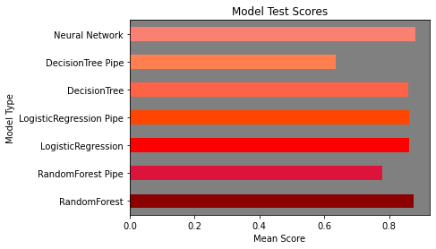

# Problem Statement

Every day we have choices. We make tens of thousands of them each and every day. The clothes we wear, how we spend or save our money, how we interact and even the thoughts we have. We make 226.7 decisions each day on food alone[1](#1). These are small but impactful choices and most of them are made in a nebulous realm of uncertainty without parameters to assist us. 

Luckily there is technology to help. This project seeks to reduce the vagueries of one such choice, the route we take to wherever it is that we want to drive. Over 3 million people are injured in car accidents in the U.S. every year and more than 90 die each day[2](#3). Every time we hit the road we are at risk. To reduce this risk we have decided to create a prototype of a web app to lend a hand in the decision making process. Clare Drive by Road Prophet is a prediction and route visualization tool that will let you be more aware of your surroundings before you start your trip. You already have tools that tell you where you will expect traffic on your trip but you will now have the ability to see which route is safest for you as well. It is also a tool to help planners and stakeholders identify high-accident areas in their city and analize them for improvement opportunities. 

Clare Drive, clarevoyance for the road. 

# Objectives

* Find reliable data to help us achieve our main objectives. 
* Clean Data so that it may be visualized and modeled. 
* Perform Exploratory Data Analysis on data to find notable relationships, trends and facts
* Preprocess the data to fit into visualizations and models
* Develop visualizations to help explore relationships further and for presentation. 
* Instantiate a Kepler.gl plot for deployment of interactive geospatial data to Streamlit app for use by target audience. 
* Train, test and tune predictive models determining likelihood of accident severity and location of accident.
* Deploy predictive models to Streamlit app for use by target audience. 

# Process

This project was conducted by a team of four data scientists. It was delegated, somewhat arbitrarily through interest of each member and quite-frankly based on real-time adaptation by the members in relation to challenges as they arose. All member's of the team initially began data cleaning and EDA. After EDA, preprocessing was conducted and three of the four members worked on initial modeling and tuning while the fourth member researched and began experimenting with Kepler.gl. After initial modeling two of the four members worked toward finalizing two separate models: one that predicted accident severity and another that predicted accident location. One member then researched and began implementation of Streamlit app for the purpose of deploying the kepler.gl interactive map and the prediction tools to a web interface for use by our target audience. The fourth member continued to work on creating visualizations and Kepler.gl instantiations that would be workable for deployment on Streamlit. 

# Notable Findings

**Analysis of Plot of Accidents by State**
__________________

States Accident Totals |  State Population Totals
:-------------------------:|:-------------------------:
  |  

* Not surprisingly California, Texas and Florida rank highest in number of accidents per state. Afterall, they are the three largest states. **What was surprising, however, is North and South Carolina in the top five.** What factors contribute to such a high number of accidents in these two states?

* Looking at the bottom tier of states appears to confirm the relationship between population and number of accidents. Again, this is not surprising. 

**Analysis of Largest Per Capita Accidents By State Plot**
__________________
* Based on the chart of total number of accidents in each state we would expect to see South Carolina and North Carolina in the top 10. Interestingly, California remains in top 3 on a per-capita basis. In light of this it appears that anecdotal evidence is confirmed by the data to be a relatively challenging state to drive in.

* North Dakot and South Dakota remain at the bottom of the charts when accident totals are adjusted on a per-capita basis. **This highlights a potential relationship between population density and accidents.** 

* Possible exceptions to population density, when considering this on a state level, is Oregon and Utah which are both in top-ten on a per-capita basis and have a diverse population of rural and urban populations. **It may be worth looking into these states further to identify per-capita proportions of accident totals on a rural county or city level.**
_____________________

**Analysis of Plot of Accident Count Per County**

County Accident Totals |  County Population Totals
:-------------------------:|:-------------------------:
  |  

* Los Angeles County, is a driver-centric metropolis tops this list almost tripling the accident count of Harris County, Texas. Harris County, the third largest county in the United States is the home of Houston and is a sprawling county growing at a 15% clip annually. These values are to be expected at the top of the chart. 

* I would like to do more analysis on population density and accident rates. If you look at the top counties for accident count Many of them are not in the top 50 of population density. So it almost seems as if at some point as population density increases then motor vehicle accidents then decrease. This is likely due to the fact that less people drive and more take mass transit. For instance, Los Angeles County is one of the largest counties by population in the United States but doesn't even break the top 50 counties based on population density. Neither does number two Harris County and number three Orange County ranks 32nd. In fact, Cook County (ranked 19th in population density) is the only county in the list of top 25 of total accident counts that cracks the top 20 via population density. [3](#3)
* This lack of extreme dense population in the highest accident count counties suggests that larger-by-land-mass, sprawling cities that are more dependent on personal motor vehicles for travel are certainly more risky than densely populated metropolis' that have a good mix of public and private transportation options. However, further research is needed here. [4](#4)
* This article published on PBS illustrates some of the reason higher-density areas have less crash rates. In a four-year long study at the University of Pennsylvania co-author of the study, Erick Guerra explains that "Fewer roads and slower traffic speeds in Philly explain some of the difference in crash rates. The region’s densest census tracts house 28% of the Delaware Valley’s population, but just 6% of all roadways and far fewer high-speed boulevards or highways. Across the five-county region, roads with average speeds of 45 miles-per-hour witnessed 10 times more deaths on average than roads with 25 miles-per-hour speed limits, the study found."[5](#5)
* Another study found that severity of crashes increases as areas become more rural. This is partly due to people wearing their seatbelts less in rural areas, higher speeds in which people travel in rural areas, increased per capital impaired driving rates and less proximity to trauma centers that can triage severe accidents. There was also some mention of people in rural areas tending to have lower wages and thus driving older cars with outdated or less existent safety features.[6](#6) 
_________________________________

**Analysis of Accidetns by Month**
* Most accidents occur at the end of the year in months September through December. 

  

_________________________________

**Analysis of Crossing and Severity Plot**
* The vast majority of all accidents that happened at a crossing had a severity of level 2. 
_________________________________

**Analysis of Junction and Severity**
* Of all the categorical features plotted to this point junction comprises the largest percentage of values accounting for around 8% of the dataset. It appears that the majority of accidents that happen near a highway ramp, exit or entrance have a severity of level 2 and many have a severity of level 3. Very few, if any have level 1 or 4. 
_________________________________

**Analysis of Plot of Station and Severity**
* It appears that mostly all of the accidents that happen near a public transportation station have a severity level of 2. 
________

**Analysis of Stop Sign and Severity**
* It appears that nearly all accidents that happen at a stop sign have a severity of level 2. I feel the amount of incidents reported at stop signs seems low. This may have to do with the integrity of the recording process but it may also be right. No way to know for sure at this point. 
________

**Analysis of Plot of Traffic Singal and Severity**

Traffic signal has been the largest of the categorical feature variables analayzed against severity to this point. The presence of a traffic signal may reduce the severity of an accident slightly as you can see the proportion of level 2 and level 3 accidents that do not have a traffic signal seems to be smaller than the proportion of level 2 over level 3 accidents that occur when a traffic signal is present. This signifies a benefit to having traffic signals present at an intersection. 
__________

# Dataset Summary

**The United States Accident Dataset** is a nationwide collection of accident data from **49 states**. It contains over **4 million samples** occuring between **February of 2016** and **December of 2019.** 

This dataset was initially created and introduced as a scholarly publication by professors and PhD students at THE Ohio State University. It was then presented at the International Conference on Advances in Geographic Information Systems in 2019. 

You can find the publication here: https://arxiv.org/abs/1906.05409
You can find more about this dataset here: https://smoosavi.org/datasets/us_accidents

**Citations:**

Moosavi, Sobhan, Mohammad Hossein Samavatian, Srinivasan Parthasarathy, and Rajiv Ramnath. “A Countrywide Traffic Accident Dataset.”, arXiv preprint arXiv:1906.05409 (2019).

Moosavi, Sobhan, Mohammad Hossein Samavatian, Srinivasan Parthasarathy, Radu Teodorescu, and Rajiv Ramnath. “Accident Risk Prediction based on Heterogeneous Sparse Data: New Dataset and Insights.” In proceedings of the 27th ACM SIGSPATIAL International Conference on Advances in Geographic Information Systems, ACM, 2019.

# Data Dictionary

Also located here: https://smoosavi.org/datasets/us_accidents

| Index | Attribute|Description|Nullable|
|-----------: | -----------:| -----------:| -----------: |
|1|ID|This is a unique identifier of the accident record.|No|
|2 | Source | Indicates source of the accident report (i.e. the API which reported the accident.). | No |
|3 | TMC | A traffic accident may have a Traffic Message Channel (TMC) code which provides more detailed description of the event. | Yes |
|4 | Severity | Shows the severity of the accident, a number between 1 and 4, where 1 indicates the least impact on traffic (i.e., short delay as a result of the accident) and 4 indicates a significant impact on traffic (i.e., long delay). | No |
|5 | Start_Time | Shows start time of the accident in local time zone. | No |
|6 | End_Time | Shows end time of the accident in local time zone. End time here refers to when the impact of accident on traffic flow was dismissed. | No |
|7 | Start_Lat | Shows latitude in GPS coordinate of the start point. | No |
|8 | Start_Lng | Shows longitude in GPS coordinate of the start point. | No |
|9 | End_Lat | Shows latitude in GPS coordinate of the end point. | Yes |
|10 | End_Lng | Shows longitude in GPS coordinate of the end point. | Yes |
|11 | Distance(mi) | The length of the road extent affected by the accident. | No |
|12 | Description | Shows natural language description of the accident. | No | 
|13 | Number | Shows the street number in address field. | Yes |
|14 | Street | Shows the street name in address field. | Yes |
|15 | Side | Shows the relative side of the street (Right/Left) in address field. | Yes |
|16 | City | Shows the city in address field. | Yes |
|17 | County | Shows the county in address field. | Yes |
|18 | State | Shows the state in address field. | Yes |
|19 | Zipcode | Shows the zipcode in address field. | Yes |
|20 | Country | Shows the country in address field. | Yes |
|21 | Timezone | Shows timezone based on the location of the accident (eastern, central, etc.). | Yes |
|22 | Airport_Code | Denotes an airport-based weather station which is the closest one to location of the accident. | Yes |
|23 | Weather_Timestamp | Shows the time-stamp of weather observation record (in local time). | Yes |
|24 | Temperature(F) | Shows the temperature (in Fahrenheit). | Yes |
|25 | Wind_Chill(F) | Shows the wind chill (in Fahrenheit). | Yes |
|26 | Humidity(%) | Shows the humidity (in percentage). | Yes |
|27 | Pressure(in) | Shows the air pressure (in inches). | Yes |
|28 | Visibility(mi) | Shows visibility (in miles). | Yes |
|29 | Wind_Direction | Shows wind direction. | Yes |
|30 | Wind_Speed(mph) | Shows wind speed (in miles per hour). | Yes |
|31 | Precipitation(in) | Shows precipitation amount in inches, if there is any. | Yes |
|32 | Weather_Condition | Shows the weather condition (rain, snow, thunderstorm, fog, etc.) | Yes |
|33 | Amenity | A POI annotation which indicates presence of amenity in a nearby location. | No |
|34 | Bump | A POI annotation which indicates presence of speed bump or hump in a nearby location. | No |
|35 | Crossing | A POI annotation which indicates presence of crossing in a nearby location. | No
|36 | Give_Way | A POI annotation which indicates presence of give_way in a nearby location. | No | 
|37 | Junction | A POI annotation which indicates presence of junction in a nearby location. | No | 
|38 | No_Exit | A POI annotation which indicates presence of no_exit in a nearby location. | No |
|39 | Railway | A POI annotation which indicates presence of railway in a nearby location. | No |
|40 | Roundabout | A POI annotation which indicates presence of roundabout in a nearby location. | No | 
|41 | Station | A POI annotation which indicates presence of station in a nearby location. | No |
|42 | Stop | A POI annotation which indicates presence of stop in a nearby location. | No |
|43 | Traffic_Calming | A POI annotation which indicates presence of traffic_calming in a nearby location. | No |
|44 | Traffic_Signal | A POI annotation which indicates presence of traffic_signal in a nearby location. | No |
|45 | Turning_Loop | A POI annotation which indicates presence of turning_loop in a nearby location. | No
|46 | Sunrise_Sunset | Shows the period of day (i.e. day or night) based on sunrise/sunset. | Yes |
|47 | Civil_Twilight | Shows the period of day (i.e. day or night) based on civil twilight. | Yes |
|48 | Nautical_Twilight | Shows the period of day (i.e. day or night) based on nautical twilight. | Yes |
|49 | Astronomical_Twilight | Shows the period of day (i.e. day or night) based on astronomical twilight. | Yes | 

**DESCRIPTION OF CRASH SEVERITY RATING**

| Rating | Short Description | Full Description|
|-----------: | -----------:| -----------:| 
|4|Fatal Injury Crash|At least one person (driver or passenger killed (within 30 days) by injuries susttained in the crash|
|3|Major Injury Crash|At least one person injured and admitted to hospital but no fatalities|
|2|Minor Injury Crash|At least by one person requiring medical care but no fataliites or injuries requiring hospitalization|
|1|Minimal Injury Crash|At least one person injured (for example minor abrasions/bruises) but no medical attention required and no other more severe injuries|

# Data Sharing and Workflow

Data Sharing and workflow was a challenge on this project. With four people in production of this model and the projects varying other components like advanced visualization with Kepler.gl and Strealit webapp deployment there was difficulty in handling a large dataset that numbered over 4.2 million samples after cleaning. 

We initially attempted to use a combination of Github and Google Colab but had issues with our data being removed from the Colab environment every time a notebook session was closed. This lead us to have to reload the data into Colab at the start of each new session. This became tiresome. We also had challenges with sharing updated or modified CSVs. File size was not only an issue with Colab but even Github with large file sharing extension was unable to handle the size of our largest data set which was around 3.14GB.

To solve this problem of sharing the data from a common location and allowing us to update our source data moved to Google Big Query and Google Cloud Platform. There were some initial challenges with permissioning all team members to access the data but they were quickly overcome. At this point one of our team members became our Google Cloud lead and started running virtual environments to do computationally expensive modeling and data transferring. 

One of our teammates also became the Github lead by setting up a single repository and managing it so that merge-conflicts and disorganization were kept to a minimum. To be sure, we still had issues, but his work there was crucial in ensuring that we had a managable work flow and we were not too bogged down in fixing errors and dealing with version control issues. 

In the end we managed to store all of our notebooks and most of our cleaned datasets in Github. The initial dataset was not able to be housed in Github due to its size but this dataset is housed at Kaggle so anyone is able to access it via the below link. 

* https://www.kaggle.com/sobhanmoosavi/us-accidents?select=US_Accidents_Dec20.csv

# Modeling
Due to the large size of our data (3.14 GB, 49 features and just over 4.22 million data points), Virtual Machines were necessary to complete the modeling process, as well as pushing our data to Google BigQuery.  This allowed for each team member to pull look at the dataset without having to spend long load times in jupyter notebooks, choose the data they wanted to use, then download it.  This drastically reduced the amount of time spent loading data into different notebooks.

Steps to Setup Google BigQuery (GBQ)
* Create GBQ project
* Add team members and edit permissions
    * Change Each users role to BigQuery User and BigQuery Data Editor.
* Create keys for each member
* Run: accidents_df.to_gbq('accidents.accidents', project_id = creds['project_id'], if_exists = 'append',reauth = True)
* Create Virtual Machine (created 2 VMs to run multiple models and a neural network simultaneously totaling 32 CPUs, 378GB RAM and 628GB of Hard Drive memory) and linked them to the GBQ the same way for each team member.  This streamlined the modeling process, allowing us to run complex neural networks in a matter of hours as opposed to days, as well as allowing us to work with much larger data sets.  At one point our severity neural network model ended up using 2036 features (after dummying certain columns) and 4.2 million data points (our final model, which performed the best used 2036 features and just over 117,000 data points).

We created 7 different models (RandomForest, a Pipeline RandomForest, LogisticRegression, a Pipeline LogisticRegression, DecisionTree, a Pipeline DecisionTree and a Neural Network).  The RandomForest and DecisionTree models performed exceptionally on the Training data, and well on the test data, however they were extremely overfit as usual.  Unfortunately, after tuning the hyperparameters for RandomForest and DecisionTree through Pipelines, they became much less overfit, however they scored much worse.  The LogisticRegression and LogisticRegression Pipeline had virtually the same scores and were neither overfit nor underfit.  The final and best model, which was the Neural Network model was the best model slightly outperforming the RandomForest model on the test data, but was not overfit.

Model Scores on Training Data |  Model Scores on Testing Data
:-------------------------:|:-------------------------:
  |  

# Model Deployment and WebApp
Once we've the model, next step was to deploy it on an webapp and publishes it for anyone to use the model's prediction. We used [Streamlit](https://www.streamlit.io/) for app development and deployment. Since the hosting service has a restriction on app size, model was trained with lesser dataset (100K). Model and the test dataset were then pickeled for deployment. A streamlit app was developed to take inputs on important features from user then pass it on to the model for its prediction. Based on user's input, the probabilities of various severities are displayed in the app screen as an output. User can play around with different inputs to understand various aspects that influences the severity of the accident.

Here is the app's URL - https://share.streamlit.io/dsi-project5/project-5/webapp.py

# Kepler.gl Installation and Usage

Kepler.gl is a powerful open source  and interctive geospatial analysis tool for large-scale data sets. It can be used in the web at kepler.gl and also within Jupyter Notebook.

### Using Kepler.gl via web

https://kepler.gl/

### Using Kepler.gl via Jupyter

Using Kepler.gl in Jupyter Notebook Documentation:
https://docs.kepler.gl/docs/keplergl-jupyter

An explanatory Medium article walking through Keppler in Jupyter from installation to visualization:
https://medium.com/vis-gl/introducing-kepler-gl-for-jupyter-f72d41659fbf

**Install Kepler.gl**

`pip install keplergl`

**If using Jupter Lab you also need to install the JupyterLab extension.**

* Jupyter also requires node greater than verion 10.15.0
* With Homebrew installed on Mac you can install node this way. 

`brew install node@10`

**Finally, install Jupyter Lab extension**

`jupyter labextenstion install @jupyter-widgets/jupyterlab-manager keplergl-jupyter`
* Note: We had difficulty getting Keppler to work within Jupyter Lab. After switching to Jupyter Notebook it deployed correctly. 

**Kepler.gl Jupyter Notebook Dependencies**

* Python greater than version 2
* ipywidgets greter than version 7

_______________________

# Geopandas Installation and Usage

GeoPandas is an open source project to make working with geospatial data in python easier. GeoPandas extends the datatypes used by pandas to allow spatial operations on geometric types. Geometric operations are performed by shapely. Geopandas further depends on fiona for file access and descartes and matplotlib for plotting. Like it's name suggests, Geopandas is designed to work similarly to the Pandas library but more specifically for Geospatial data. 

**Geopandas User Guide**
https://geopandas.org/

**Geopandas Examples Gallery**
https://geopandas.org/gallery/index.html

**Geopandas Install Documentation:**

https://geopandas.org/install.html

**install Geopandas**

`conda install --channel conda-forge geopandas`

or 

`conda install --channel conda-forge geopandas`

or 

`pip install geopandas`

**See Geopandas install documentation above for more information on each install method and for alternative methods of install directly from Github.**

**GEOPANDAS DEPENDENCIES** Also found in the above Geopandas documentation. 

* numpy
* pandas (version 0.23.4 or later)
* shapely (interface to GEOS)
* fiona (interface to GDAL)
* pyproj (interface to PROJ; version 2.2.0 or later)

**See install link above for further, optional dependencies:**

# Sources

* [1] How Many Decisions Do We Make? 
    * http://science.unctv.org/content/reportersblog/choices#:~:text=We%20make%20thousands%20of%20choices%20every%20day&text=It's%20estimated%20that%20the%20average,are%20both%20good%20and%20bad.

* [2] Car Accident Statistics 
    * https://www.driverknowledge.com/car-accident-statistics/
    

* [3] List of most populous counties in the United States
    * https://en.wikipedia.org/wiki/List_of_the_most_populous_counties_in_the_United_States

* [4] List of most densely populated counties in the United States. 

    * https://en.wikipedia.org/wiki/County_statistics_of_the_United_States#Most_densely_populated

* [5] City driving often safer than the burbs
    * https://whyy.org/articles/study-city-driving-often-safer-than-the-burbs/

* [6] Car crash death rates highest in remotest rural areas
    * https://www.reuters.com/article/us-health-rural-autos-crash/car-crash-death-rates-highest-in-remotest-rural-areas-idUSKBN1CA2EW

